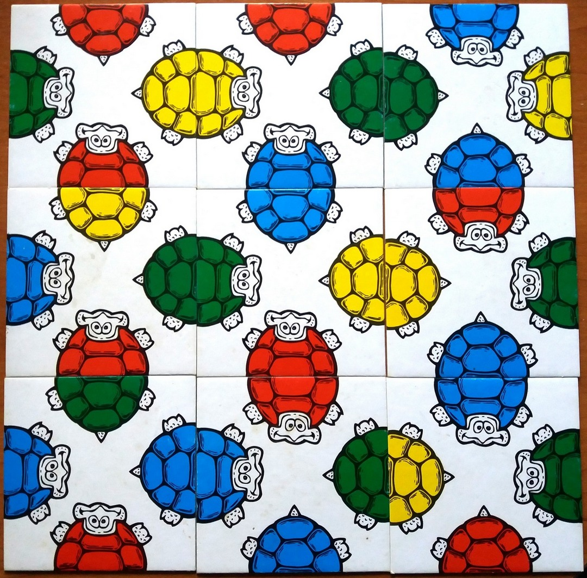
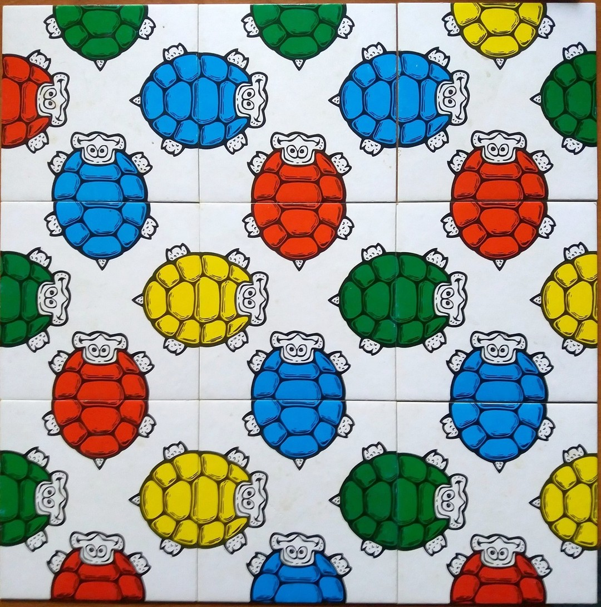

# crazy-turtles-puzzle-game-solver
Program finds all possible valid combinations of turtle cards in game "Crazy Turtles Puzzle Game".

## Game Rules:

Crazy Turtles Puzzle Game comes with 9 square cards. Each card displayes half of an image (turtle) on every edge. 
The object of the puzzle is to arrange the nine pieces in a 3X3 square where all of the images matched up. 
For example the tail of a turtle would be one card and that would need to match the head of the turtle which was on a different card.

## One solution:

