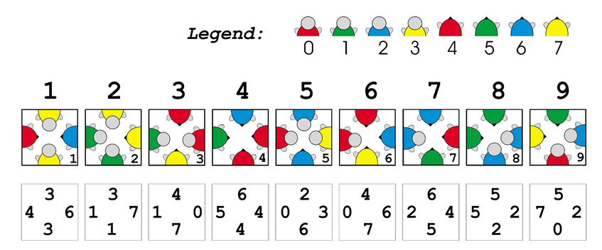

# crazy-turtles-puzzle-game-solver
Program finds all possible valid combinations of turtle cards in game "Crazy Turtles Puzzle Game".

## Game Rules:
Crazy Turtles Puzzle Game comes with 9 square cards. Each card displayes half of an image (turtle) on every edge. 
The object of the puzzle is to arrange the nine pieces in a 3X3 square where all of the images matched up. 
For example the tail of a turtle would be one card and that would need to match the head of the turtle which was on a different card.

## One solution:

You can check all possible solutions in the solutions.txt file.

## Details on implementation
For solving the puzzle and achive all possible solutions, backtrack approach has been used.
In the following pictures you can see how the problem is modeled. 

- rotation 0 = no rotation
- rotation 1 = 90 degree in clockwise direction or one steр
- rotation 2 = 180 degree in clockwise direction or two steps
- rotation 3 = 270 degree in clockwise direction or three steps

Example: 4->1 would mean Card Number 4 that we have
rotate clockwise for 90 degrees.

